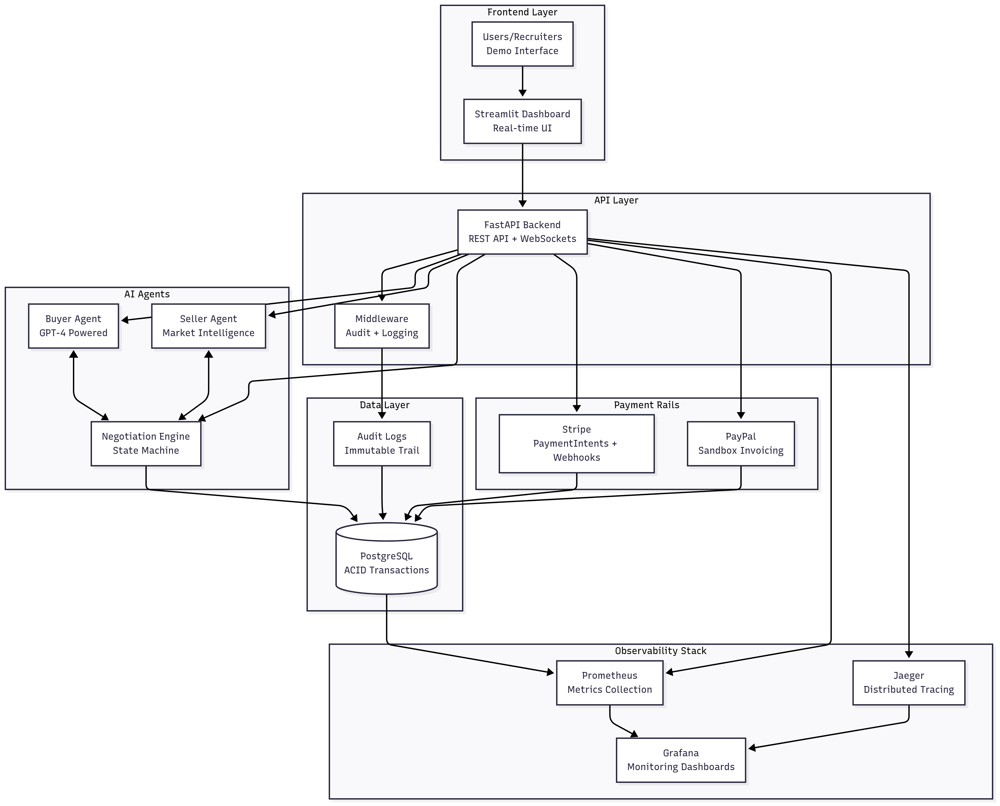

# 🧠 Agent Compute Marketplace

[](https://github.com/sanchit-kumar-personal/agent-compute-marketplace/actions/workflows/ci.yml)
[](LICENSE)
[](https://python.org)
[](https://fastapi.tiangolo.com)
[](Dockerfile)
[](https://github.com/sanchit-kumar-personal/agent-compute-marketplace/releases)

> **🎬 Demo Ready!** AI-powered marketplace where autonomous agents negotiate cloud compute resources and settle payments using real-world payment rails (Stripe, PayPal). Complete with observability stack, audit trails, and 90%+ test coverage.
>
> **🚀 v1.0.0 Production Ready** - Fully tested, documented, and ready for deployment.

## ✨ What This Demonstrates

- **AI Agent Negotiations** - GPT-powered buyer/seller agents that autonomously negotiate prices
- **Real Payment Processing** - Stripe and PayPal integration with webhooks and idempotency
- **Production Patterns** - OpenTelemetry tracing, Prometheus metrics, structured logging
- **Enterprise Audit** - Complete transaction trail with PostgreSQL persistence
- **Full Stack** - FastAPI backend, Streamlit dashboard, Docker orchestration

---

## 🚀 Quick Start

### One-Command Demo

```bash
git clone https://github.com/sanchit-kumar-personal/agent-compute-marketplace.git
cd agent-compute-marketplace
cp env.example .env
# Add your OpenAI/Stripe/PayPal keys to .env

docker compose up -d --build
```

**What happens automatically:**

- 🗄️ Database migrations run on first startup
- 🌱 Initial inventory seeded (100 GPU, 500 CPU, 50 TPU units)
- 🚀 All services start with health checks

**Access Points:**

- **API Docs:** http://localhost:8000/docs
- **Dashboard:** http://localhost:8501
- **Grafana:** http://localhost:3000 (admin/admin)
- **Jaeger Traces:** http://localhost:16686
- **Prometheus:** http://localhost:9090

### Demo Flow (2 minutes)

```bash
# 1. Check available compute resources (uses simulated inventory)
curl http://localhost:8000/api/v1/resources/availability

# 2. Create quote (AI pricing)
curl -X POST http://localhost:8000/api/v1/quotes/request \
  -H "Content-Type: application/json" \
  -d '{"buyer_id":"demo","resource_type":"GPU","duration_hours":4,"buyer_max_price":2.0}'

# 3. Run AI negotiation
QUOTE_ID=$(curl -s http://localhost:8000/api/v1/quotes/recent | jq -r '.[0].id')
curl -X POST http://localhost:8000/api/v1/quotes/$QUOTE_ID/negotiate

# 4. Process payment
curl -X POST http://localhost:8000/api/v1/quotes/$QUOTE_ID/payments?provider=stripe \
  -H "Content-Type: application/json"

# 5. View audit trail
docker compose exec db psql -U agentcloud -d agentcloud \
  -c "SELECT action, payload FROM audit_logs ORDER BY id DESC LIMIT 3;"
```

## 📊 Real-Time Dashboard


_Live negotiation tracking with metrics, audit trails, and payment status_

---

## 🏗️ Architecture



_Comprehensive system showing AI agents, payment rails, and observability stack_

## 🛠️ Tech Stack

| Component          | Technology                  | Purpose                         |
| ------------------ | --------------------------- | ------------------------------- |
| **Backend**        | FastAPI + SQLAlchemy        | REST API with type safety       |
| **Agents**         | OpenAI GPT-4                | Autonomous price negotiation    |
| **Payments**       | Stripe + PayPal SDKs        | Real payment processing         |
| **Database**       | PostgreSQL                  | ACID transactions + audit logs  |
| **Observability**  | OTEL + Prometheus + Grafana | Production monitoring           |
| **Frontend**       | Streamlit                   | Real-time negotiation dashboard |
| **Infrastructure** | Docker Compose              | Full-stack orchestration        |

## 📊 Key Features

### AI-Powered Negotiations

- **Buyer Agent**: Analyzes market conditions, makes counter-offers
- **Seller Agent**: Dynamic pricing based on demand and inventory
- **Negotiation Engine**: Multi-turn conversations with state management
- **Market Intelligence**: Price history and trend analysis

### Payment Processing

- **Stripe Integration**: PaymentIntents with idempotency keys
- **PayPal Integration**: Sandbox invoicing with webhook handling
- **Transaction Tracking**: Complete audit trail for all payments
- **Error Handling**: Graceful degradation and retry logic

### Enterprise Observability

- **Distributed Tracing**: OpenTelemetry with Jaeger visualization
- **Custom Metrics**: Quote rates, negotiation latency, payment success
- **Structured Logging**: JSON logs with trace correlation
- **Grafana Dashboards**: Auto-provisioned monitoring panels

### Security & Compliance

- **Audit Logs**: Every action logged to `audit_logs` table
- **Secret Management**: Environment-based configuration
- **Input Validation**: Pydantic schemas with type checking
- **Error Boundaries**: Proper exception handling and rollbacks

---

## 📁 Project Structure

```
agent-compute-marketplace/
├── agents/                 # AI buyer/seller agent implementations
├── api/                   # FastAPI routes and schemas
├── core/                  # Settings, logging, metrics, tracing
├── db/                    # SQLAlchemy models and sessions
├── negotiation/           # FSM engine and prompt templates
├── payments/              # Stripe/PayPal service implementations
├── dashboard/             # Streamlit real-time dashboard
├── tests/                 # 90%+ coverage test suite
├── alembic/               # Database migrations
├── docs/                  # Grafana configs and documentation
└── scripts/               # Deployment and utility scripts
```

## 🧪 Testing & Quality

- **90%+ Test Coverage** - Comprehensive pytest suite
- **CI/CD Pipeline** - GitHub Actions with PostgreSQL
- **Code Quality** - Ruff linting + Black formatting
- **Type Safety** - Full mypy compliance
- **Docker Ready** - Multi-stage builds with health checks

```bash
# Run full test suite with coverage
make test

# Check code quality
make lint

# Format code
make format
```

## 🌐 Environment Setup

**1. Copy environment template:**

```bash
cp env.example .env
```

**2. Add your API keys:**

```bash
# Required for AI negotiations
OPENAI_API_KEY=sk-your-key-here

# Required for payments (use test keys)
STRIPE_API_KEY=sk_test_your-key-here
STRIPE_WEBHOOK_SECRET=whsec_your-secret-here

# Required for PayPal (sandbox)
PAYPAL_CLIENT_ID=your-sandbox-client-id
PAYPAL_SECRET=your-sandbox-secret
```

**3. Start services:**

```bash
docker compose up -d
```

## 📈 Monitoring & Observability

### Grafana Dashboards

- **Business Metrics**: Quote creation rates, negotiation success
- **System Metrics**: HTTP latency, error rates, database performance
- **Payment Metrics**: Transaction volume by provider

### Jaeger Tracing

- **End-to-End Visibility**: From API request to payment completion
- **Performance Analysis**: Identify bottlenecks in negotiation flow
- **Error Tracking**: Trace failed requests across service boundaries

### Audit Trail

```sql
-- Example audit query
SELECT action, payload->>'amount' as amount, created_at
FROM audit_logs
WHERE quote_id = 123
ORDER BY created_at;
```

## 🎯 Demo Scenarios

### Scenario 1: Successful Negotiation

1. Create quote with buyer max price $2.00
2. Seller prices at $1.80
3. Buyer accepts immediately
4. Payment processed via Stripe

### Scenario 2: Multi-Round Negotiation

1. Create quote with buyer max price $1.50
2. Seller starts at $2.20
3. 3 rounds of counter-offers
4. Final agreement at $1.75

### Scenario 3: Payment Failure Recovery

1. Complete negotiation successfully
2. Simulate Stripe payment failure
3. Audit logs capture failure details
4. Retry with PayPal successfully

---

## 🚀 Development Commands

```bash
# Development server with hot reload
make dev

# Run tests with coverage
make test

# Format and lint code
make lint

# Database migrations
make migrate

# Docker development
make docker-up
make docker-down

# View all commands
make help
```

## 📝 License

MIT License - see [LICENSE](LICENSE) file for details.

---

**Built to showcase:** AI agent development • Payment integration • Observability patterns • Enterprise software practices
